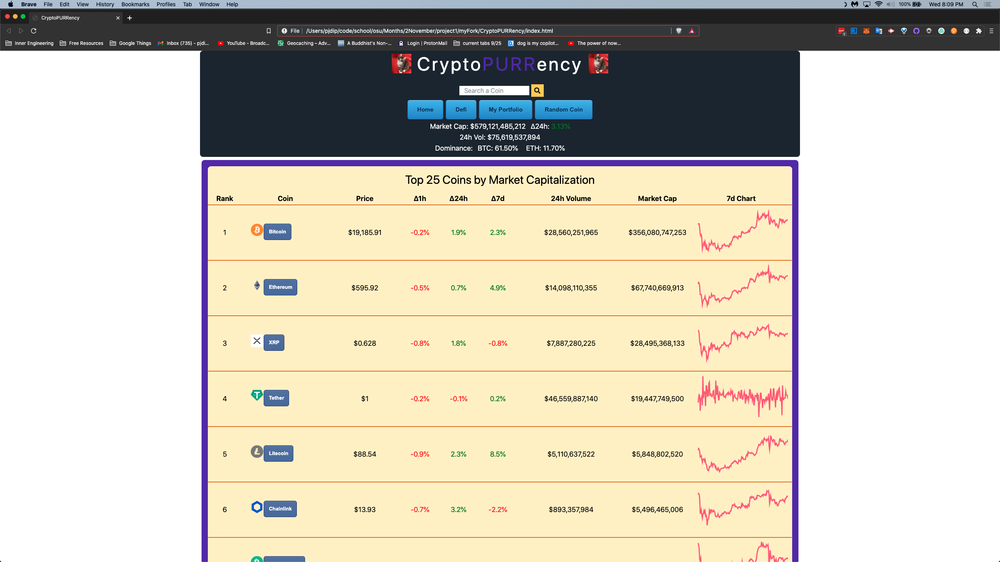
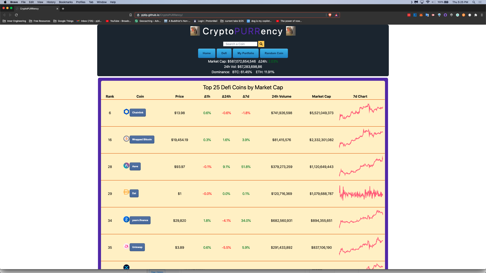
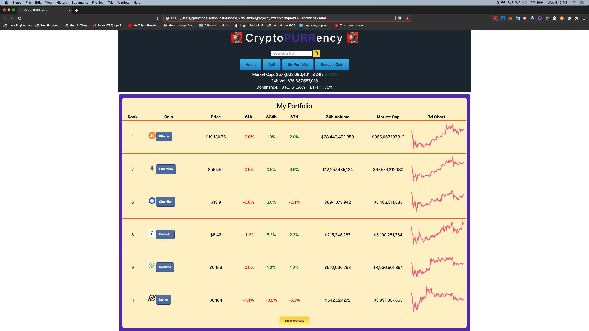
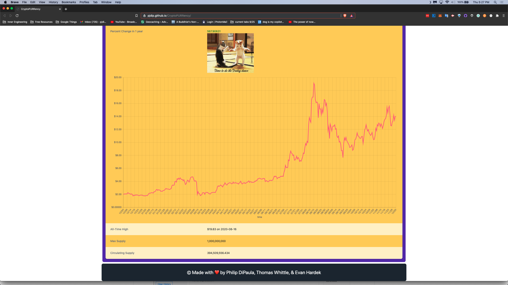
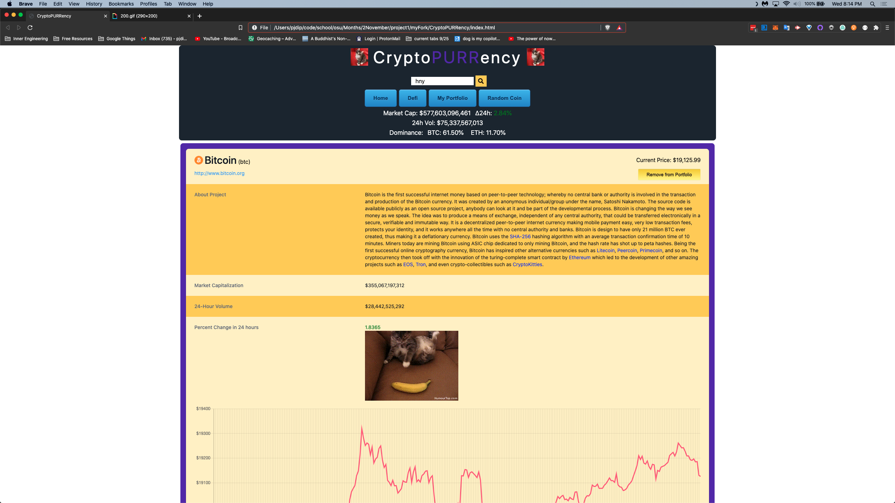
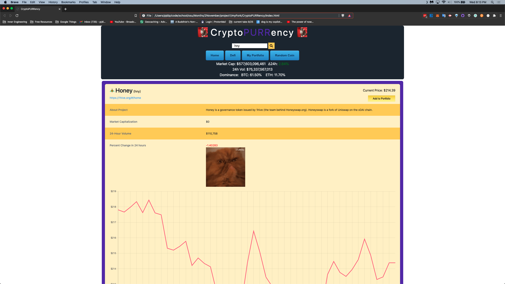
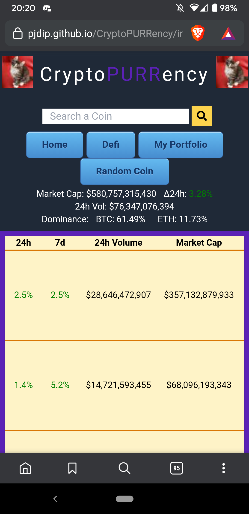
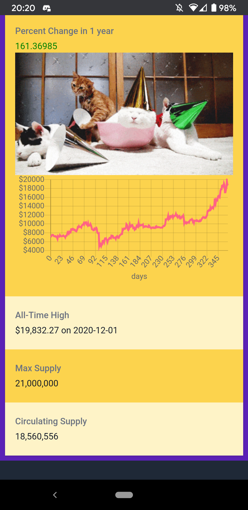
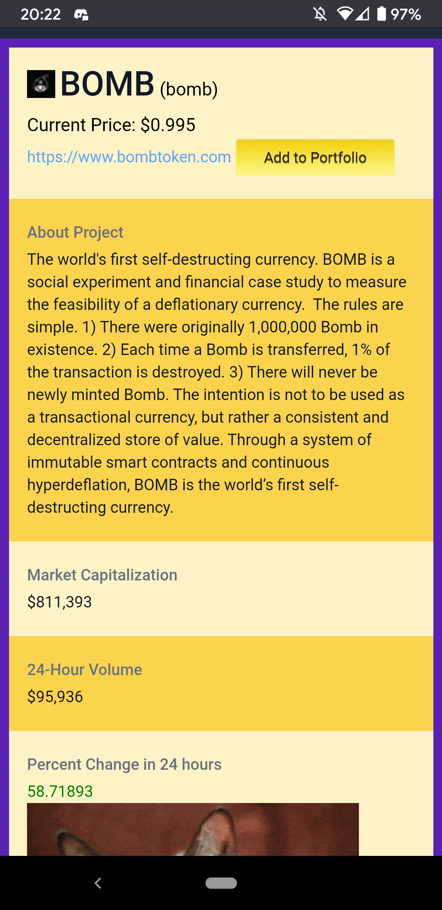

# CryptoPURRency

## These are the files for the first OSU Web Development Bootcamp Project Assignment

Here is a [link](https://settc.github.io/CryptoPURRency/) to the live page :D

The goal of this project was to use our newly acquired skills and knowledge to build a web application from scratch. In order to do this, we needed to learn how to use git more effectively in a team setting and harness our creativity. The app we created allows the user to search for a cryptocurrency and find current and past market data on that coin.

* [Installation](#installation)
* [Usage](#usage)
* [Credits](#credits)
* [Badges](#badges)
* [License](#license)

## Installation

The only thing you will need to have installed in order to run the index.html file is a functioning web browser. It should work with most versions of most browswers. I highly recommend the Brave browser for this app, as you will be paid in the Basic Attention Token (BAT) for viewing ads, instead of being bombarded with ads and getting nothing for it. It is also valuable to use this browser, as it is in keeping with the theme of the project. The webpage will require access to the localStorage on your browser in order to save the portfolio properly.

## Usage 

In order to use this project, simply open the index.html in your favorite browser or open the link provided above. There are several ways to interact with this application. Using the search bar, you may search for any coin by name, symbol or coingecko ID. You will be alerted if you search for something that is not supported by coingecko.

Initially, you will find you have been presented with a table of the top 25 cryptocurrencies by market capitalization. Click on the name of any coin to be shown more data about that coin. The "Home" button below the search bar will return you to this table. The "Defi" button will take you to a table of the top 25 cryptocurrencies by market capitalization that fall within the decentralized finance category. Any coin in this table may be clicked as well. The "Random Coin" button will show you the data of a random coin chosen from amongst the coins supported by the Coingecko API. There are some weird ones in there. Once you have visited a coin's page you may add it to your portfolio by clicking the "Add to Portfolio" button. Once you have some coins in your portfolio, the "My Portfolio" button will take you to a table consisting of all of the coins you have added to your portfolio. The data in each table is relatively self explanatory.
If one of these tables is too large to fit your screen, simply scroll to the right to see the rest of the table.

Below the main page buttons, you will find some data about the entire cryptocurrency market. This includes the market capitalization of the entire market in US dollars, the change in market capitalization in percents over the past 24 hours (green means an increase, red means a decrease), the total 24 hour trading volume of the entire market in US dollars, and the bitcoin and ethereum dominance (this refers to what percentage of the total market capitalization resides in each of these coins)

Once you click on a specific coin to learn more about it you will be presented with some basic information about that coin. This includes the name, ticker symbol (usually 3-5 letters), the current price, market capitalization, 24 hour volume, the percentage change over different time intervals, graphs showing the price over those time intervals, cat gifs to inform you how to feel about these price changes, the maximum number of units for that coin, and the currently circulating number of units, and the all time high value of that coin in US dollars, and the date upon which that price was achieved. Extremely importantly, you will also be provided with a link to that project's main page where you can go to do your own research and a brief description of that project. 

Here are some screenshots:
From Desktop:

From Mobile:

## Credits

Special Thanks to CoinGecko API documentation:
* [GUI](https://www.coingecko.com/api/documentations/v3#/)
* [swagger.json](https://www.coingecko.com/api/documentations/v3/swagger.json)

Thanks to Tailwind documentation:
* [main docs](https://tailwindcss.com/docs)
* [components](https://tailwindui.com/components)

Thanks to Giphy documentation:
* [main docs](https://developers.giphy.com/docs/api#quick-start-guide)

Thanks to Chart.js documentation:
* [main docs](https://www.chartjs.org/docs/latest/getting-started/)

Thanks to stackoverflow for help with:
* [object index function](https://stackoverflow.com/questions/8668174/indexof-method-in-an-object-array/38516944)
* [big number formatting](https://stackoverflow.com/questions/2901102/how-to-print-a-number-with-commas-as-thousands-separators-in-javascript)

Thanks to MDN for [string manipulation](https://developer.mozilla.org/en-US/docs/Web/JavaScript/Reference/Global_Objects/String/slice)

Thanks to jQuery documentation for help with [tree-traversal](https://api.jquery.com/category/traversing/tree-traversal/)

Thanks to www.geeksforgeeks.org for help with [parsing html](https://www.geeksforgeeks.org/jquery-parsehtml-method/)

Special Thanks to [ChilledCow](https://www.youtube.com/channel/UCSJ4gkVC6NrvII8umztf0Ow) for providing chill lofi beats to code to

## Badges

## License

Licensed under the [GNU General Public License v3.0](https://choosealicense.com/licenses/gpl-3.0/)

---